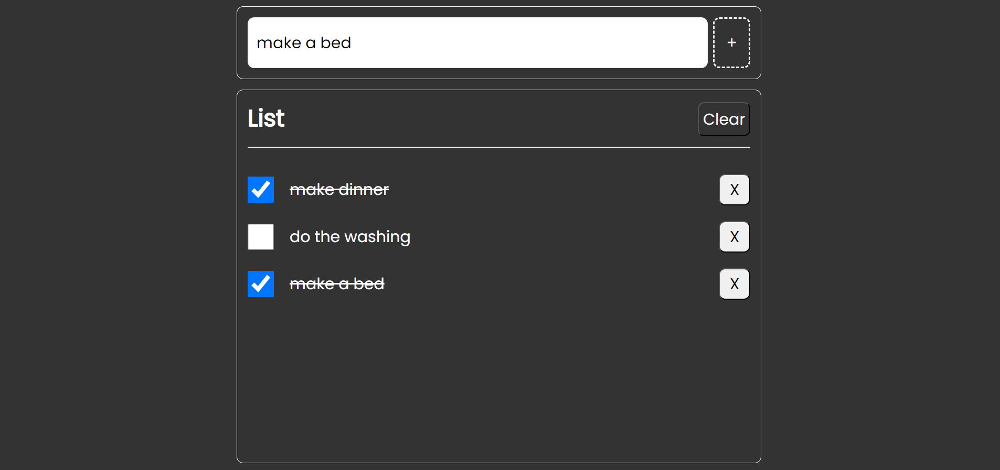

# To-Do List Application
A simple and efficient To-Do List application built using TypeScript and Vite. This app allows you to manage your tasks easily, with features like adding and deleting tasks.

## Features
:white_check_mark: Add New Tasks: Quickly add new tasks to your to-do list.

:white_check_mark: Delete Tasks: Remove tasks that are no longer needed.

:white_check_mark: Clear the entire list. Delete all tasks if they are completed or no longer needed.

:white_check_mark: Mark as Complete: Mark tasks as completed to keep track of your progress.
  
  
  

## Technologies Used

* TypeScript: For strong typing and enhanced code quality.
* Vite: For fast and modern front-end tooling.
* CSS: For styling the application.
